# 📝 DevNotes — Interview Knowledge Base

Ứng dụng quản lý notes phỏng vấn, chạy local bằng Python + Flask.
Dữ liệu lưu vào file `data/notes.json`.

---

## 🚀 Cài đặt & Chạy

```bash
# 1. Cài dependencies
python3 -m venv venv
source venv/bin/activate
pip install -r requirements.txt

# 2. Để hủy

deactivate
rm -rf venv

# 2. Chạy server
python app.py

# 3. Mở browser
http://localhost:5000
```

Lần đầu chạy sẽ tự seed dữ liệu mẫu vào `data/notes.json`.

---

## 📁 Cấu trúc thư mục

```
devnotes/
├── app.py
├── templates/
├── static/
├── traefik/
├── config/
│   └── __init__.py
├── db/
│   ├── __init__.py
│   ├── _shared.py
│   ├── sqlite.py
│   ├── postgres.py
│   └── mongo.py
├── routes/
│   ├── auth.py
│   ├── notes.py
│   ├── topics.py
│   ├── images.py
│   └── data.py
├── services/
│   ├── telegram.py
│   └── image_cache.py
└── utils/
    └── auth_utils.py
```

---

## Architecture

 

---

## ⌨️ Phím tắt

| Phím | Chức năng |
|------|-----------|
| `Ctrl+K` | Focus ô tìm kiếm |
| `Ctrl+N` | Thêm note mới |
| `Esc`    | Đóng modal |

---

## 💾 Backup dữ liệu

Chỉ cần copy file `data/notes.json` là xong.
Hoặc dùng nút **Export JSON** trong app để tải về.
